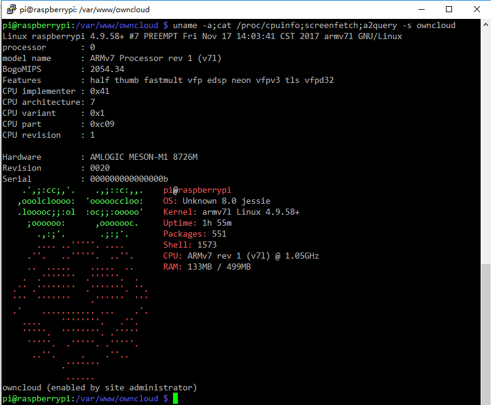
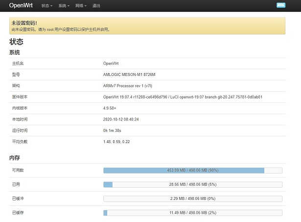

Amlogic 8726m for raspbian
==========================

[Raspbian kernel source project][link]

[link]: https://github.com/raspberrypi/linux

    一只很古老的机顶盒，奇怪的居然有 sata 接口。因此装上 owncloud 做备份。SoC 是晶晨AML8726-M，运行andorid 2.3.5。
    不能安装 owncloud 这里移植几个驱动到 kernel 4.9，使 raspbian 可以直接运行，-_-!没有图形模式噢。不过，方便安装 owncloud

    现支持的驱动：
        ethernet
        mmc/sd
        sata （未测试）
        uart
        usb  （20201012）

    需要一条 ttl 线。装载并运行 raspbian，登录机顶盒都是必要的。

#### 编译

    在ubuntu 16.04 上

    1, sudo apt install gcc-arm-linux-gnueabihf

    2, make meson_mbx_defconfig

    3, ./make-uImage.sh -j8       ; 8个任务编译

    文件 arch/arm/boot/uImage 

#### 烧录

    下载 raspbian-xxx-lite.img 写到 sd卡后执行

    dd if=arch/arm/boot/uImage of=/dev/‘sdcard for raspbian' bs=512 seek=1

#### 启动

    插入刚刚的sd卡到机顶盒
    连接串口线到机顶盒 ttl，使 uboot 的 log 信息可见，回车后进入 amlogic uboot 环境

    执行

    1，setenv mmcargs setenv bootargs console=$\{console\} root=/dev/mmcblk0sd2 rootfstype=ext4 elevator=deadline rootwait mac=$\{ethaddr\} clk81=$\{gpuclock\} netcheck=$\{netcheck\} fsck.repair=yes
    2, setenv mmcboot run mmcargs\;mmcinfo\;mmc read 0 $\{loadaddr\} 200 400000\;bootm $\{loadaddr\}
    3, setenv bootcmd run mmcboot

    有些 amlogic uboot 的 mmc read 可能不同的，要按扇区来读写，则第二条应该像这样
    setenv mmcboot run mmcargs\;mmcinfo\;mmc read 0 $\{loadaddr\} 1 2000\;bootm $\{loadaddr\}

    保存执行命令
    4，saveenv

    执行 reset

    booting....

    只能在 ttl 上第一次登录，然后打开 ssh
    raspbian jessie 版执行 sudo apt install owncloud
    OO, 得到 owncloud 。。。

#### UBS

	usb 在 host mode 下不太兼容 kernel 4.x 的 autosuspend ，若有问题请在 kernel 启动参数中加上 usbcore.autosuspend=-1 
	

#### 结束

    单核 512M 内存，实在很难跑图形界面，openwrt 很合适，安装 rasperry pi 的 openwrt 固件，做个文件和下载的静音主机，由于
    没有 hard-float 指令支持，只能安装树莓派第一代的固件噢。

